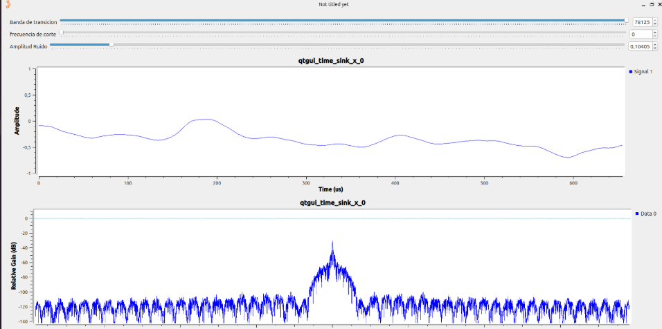
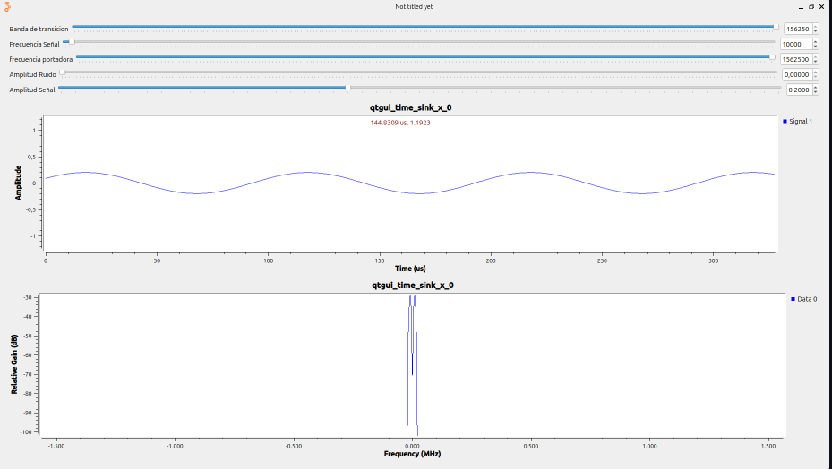
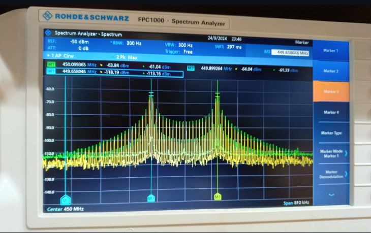

En la práctica 2, nos enfocamos en la transmisión inalámbrica y en analizar cómo afecta el ruido blanco gaussiano a los sistemas de comunicación. Usamos una antena para transmitir y otra para recibir, y así pudimos observar el espectro de la señal y medir cosas importantes como el ancho de banda y la potencia máxima. También aprendimos que es muy importante ajustar bien la ganancia y centrar la frecuencia de la portadora para obtener mediciones claras y correctas del espectro.

El análisis del ruido blanco gaussiano permitió estudiar variables como la banda de transición, frecuencia de corte y amplitud del ruido afectan el dominio del tiempo y el espectro de frecuencia; Herramientas como máscaras espectrales facilitaron la comparación entre señales con y sin ruido, posibilitando el cálculo de la relación señal-ruido (SNR) y su dependencia con la frecuencia de la portadora. Esta práctica reforzó conceptos esenciales del diseño y análisis de sistemas de comunicaciones, destacando la relación entre el ancho de banda y la frecuencia de corte, así como el impacto del ruido en el desempeño del sistema.

Primera Parte:

En este caso, como se ve en las gráficas anteriores, se diseñó un esquema para analizar cómo afecta el ruido blanco gaussiano a un sistema, tomando en cuenta variables como la banda de transición, la frecuencia de corte, la amplitud del ruido, y la frecuencia y amplitud de la señal. Se estudió cómo estos factores cambian la señal en el tiempo y en su espectro de frecuencia, poniendo especial atención en cómo influye la frecuencia de corte en el sistema.

Segunda Parte:

Se conectó una antena al receptor del radio y se alineó con la antena transmisora para poder captar el espectro de la señal enviada. Después, usamos marcadores para estimar el ancho de banda y la potencia máxima. Todo esto lo habíamos visto en la teoría y en la práctica pudimos complementarlo, lo que nos ayudó a entender mejor el tema.
