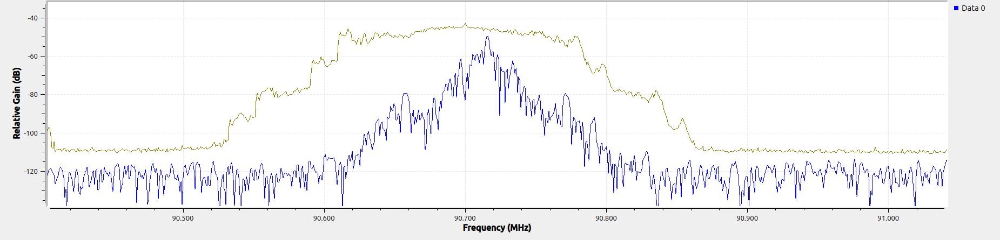
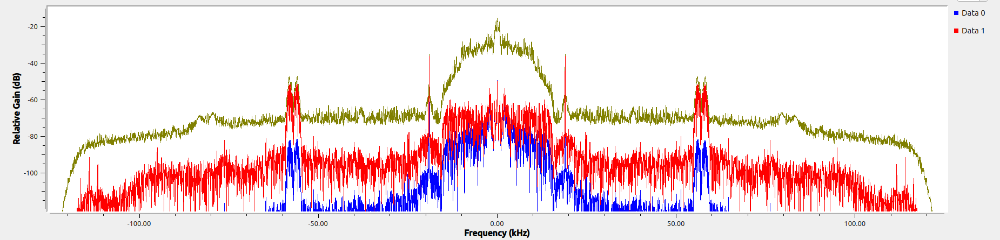
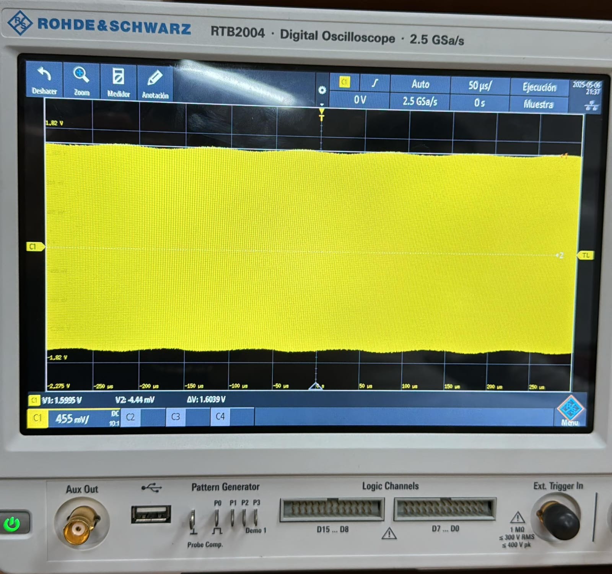
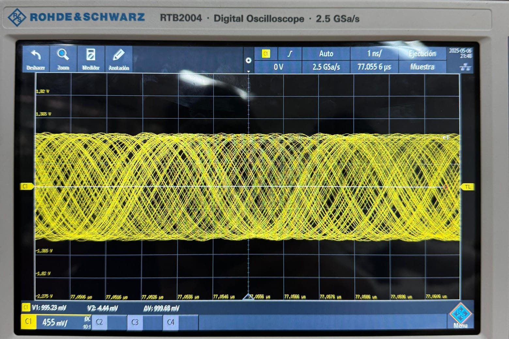
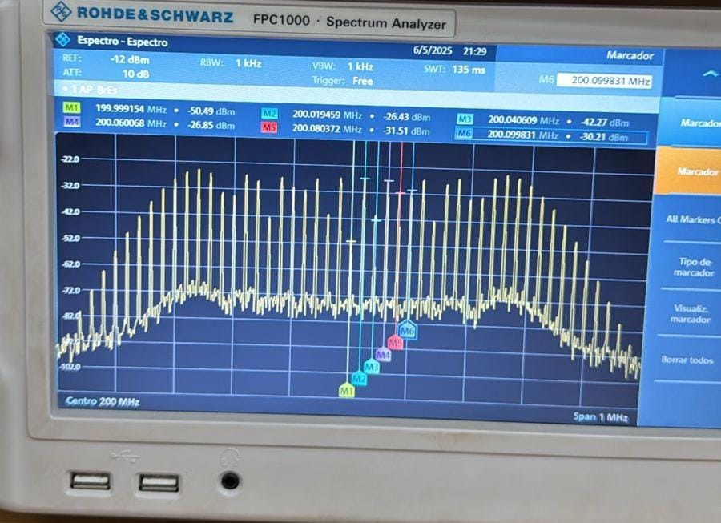

En la práctica 4, “Modulaciones Angulares”, estudiamos señales de modulación de fase (PM) de banda ancha cambiando el valor de Kp·Am. Primero, con un osciloscopio y un analizador de espectro medimos la señal en el tiempo y en frecuencia. Para valores bajos de Kp·Am observamos la forma de onda, calculamos la potencia de la envolvente compleja y su ancho de banda. Después subimos la frecuencia de muestreo a 6,25 MHz para probar con valores más altos de Kp·Am y vimos que aparecían más armónicos. Por último, usamos una función de excel para comparar los coeficientes de Bessel teóricos con los datos experimentales y estimar la potencia total de la señal modulada.

**Parte A:**

La imagen muestra el espectro de una emisora de FM centrada en 90,7 MHz, donde la curva amarilla representa la envolvente que retiene el máimo y la azul la emisora original mosulada. En el centro, se ve un pico claro en 90,7 MHz (la portadora) y a ambos lados, de 90,6 a 90,8 MHz, aparecen las bandas laterales que contienen la información de audio, con un ancho de banda total de unos 200 kHz. Fuera de estas bandas, el ruido de fondo se sitúa alrededor de –120 dB a –130 dB.

La imagen muestra cómo quedan las frecuencias una vez extraída la señal de radio. La línea amarilla dibuja el contorno suave, y las rojas y azules el detalle fino. En el centro (hasta unos ±15 kHz) está el audio normal que escuchas. Luego, a ±19 kHz, aparece un tono piloto pequeñito que sirve para el estéreo, y alrededor de ±38 kHz va la información que separa los canales izquierdo y derecho. También se ve un pico muy pequeño cerca de ±57 kHz que transmite datos extra (RDS). Por fuera de todo eso, solo queda un ruido de fondo muy bajo.

**Parte B:**

Si la modulación de fase es muy pequeña (con un índice menor a 0,1), la señal se comporta casi como una señal modulada en amplitud (AM).

Con índices de modulación más altos se nota que la señal y su fase cambian; aunque medirlo con exactitud es complicado, el efecto sí se aprecia.

Se pretende medir, con el analizador de espectros, la potencia de los armónicos según los coeficientes de Bessel que aparecen en la tabla del PDF.

