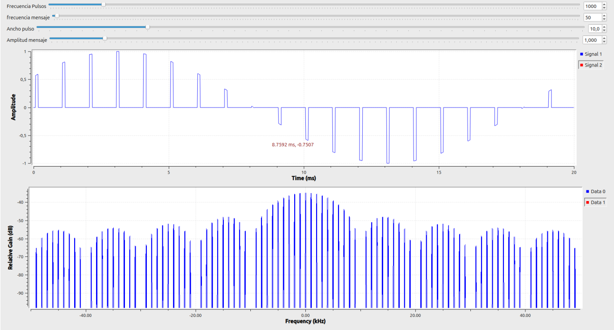
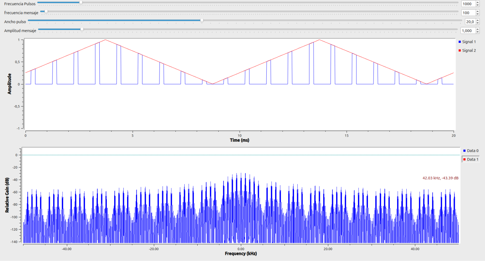
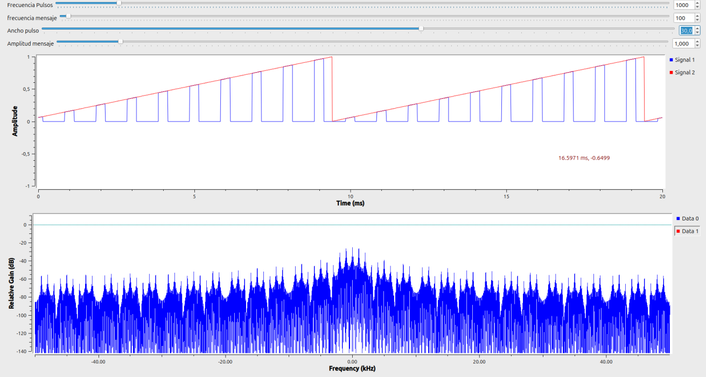
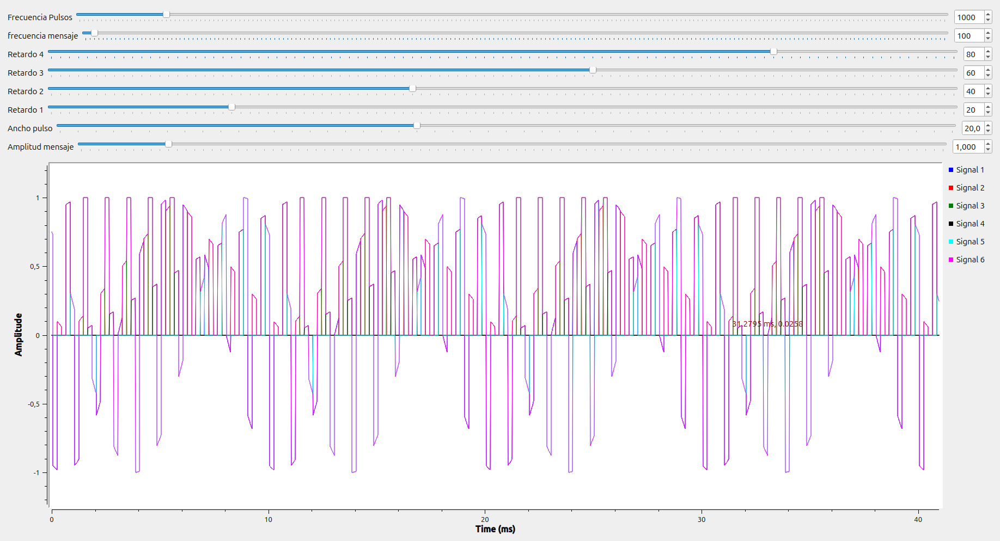
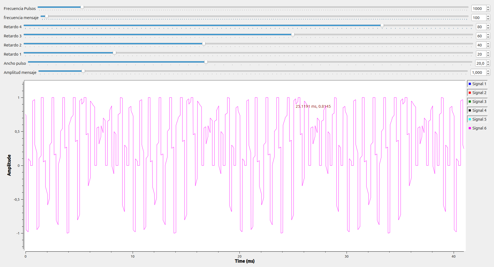
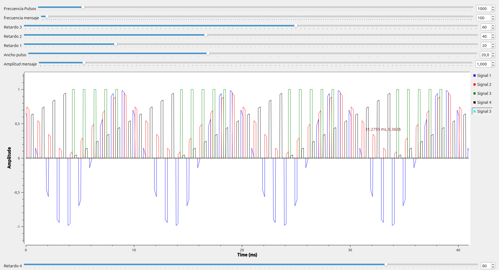
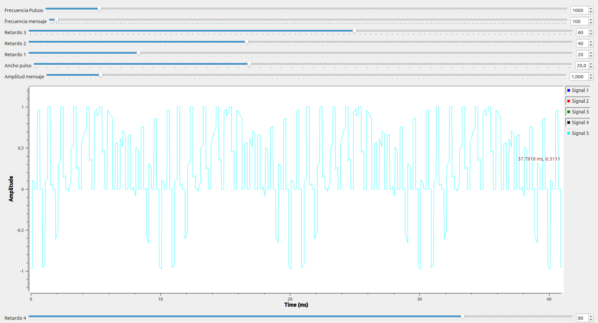

**PUNTO 1A**

Se emplearon tres tipos de señales como moduladoras: diente de sierra, cuadrada y senoidal, todas con una frecuencia de pulsos de 500 Hz y una frecuencia de mensaje de 100 Hz, lo que implica una relación fpulso / fmensaje = 5, es decir, ocurren cinco pulsos por cada ciclo de la señal de mensaje. Además, se utilizó una relación de muestreo samp_rate / fs = 100, lo que garantiza una representación digital adecuada de las señales.
La señal diente de sierra fue utilizada en un esquema de modulación por posición de pulso (PPM), en el que el desplazamiento temporal de cada pulso es proporcional a la amplitud de la señal de mensaje. En el caso de la señal cuadrada, el tren de pulsos se modula entre dos posiciones fijas, lo que equivale a una modulación PPM binaria, generando un espectro más disperso con mayor presencia de componentes de alta frecuencia. Por su parte, la señal senoidal produce un espectro más limpio y concentrado, con componentes alrededor de la frecuencia del mensaje, debido a la transición suave de su forma de onda.
En términos generales, la forma de la señal de mensaje influye directamente en el comportamiento del tren de pulsos generado en la modulación PPM. Además, en el dominio de la frecuencia, se observa que cuanto más suave es la señal de mensaje, más concentrado y ordenado es el espectro; mientras que señales con transiciones abruptas generan espectros más amplios y dispersos.

**PUNTO 2A**

Para multiplexar varios canales usando división en el tiempo (TDM), se aplicaron retardos distintos a cada señal: para 4 canales se usaron 20 ms, 40 ms, 60 ms y 80 ms; y para 5 canales, 25 ms, 50 ms, 75 ms, 100 ms y 125 ms. Estos retardos permiten que cada señal se transmita en un momento diferente dentro del mismo ciclo, evitando que se crucen o interfieran entre sí. 

**PUNTO B**

