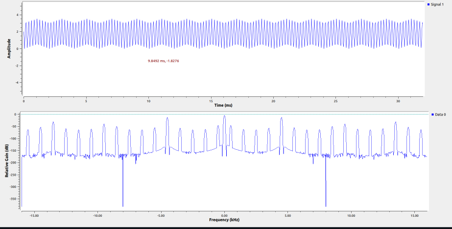

En la primera práctica, aprendimos a usar GNU Radio, un programa que sirve para simular sistemas de comunicación. El objetivo principal fue conocer los conceptos básicos y entender cómo funcionan los bloques que forman un sistema de comunicación digital. También buscamos practicar cómo armar y ajustar estos sistemas.

Durante la actividad, se armó un sistema básico para probar cómo cambiar parámetros importantes, como la frecuencia de operación y la frecuencia de muestreo de las señales. También se crearon diferentes tipos de señales, que se analizaron viendo cómo se comportan en el tiempo y en la frecuencia, usando las herramientas gráficas y de análisis que ofrece GNU Radio.

Parte A:

En esta gráfica se puede ver cómo cambia la señal cuando se modifican parámetros como la frecuencia de muestreo y la amplitud. Esto nos ayuda a seguir las instrucciones y a entender mejor los conceptos básicos al conectar los bloques.

Parte B:

Pudimos observar dos señales senoidales, a las cuales les fuimos cambiando la fase para ver cómo se comportaban. Así, se pudo notar el desfase entre ellas. Todo esto nos ayuda a entender mejor los conceptos y a lograr buenos resultados.

